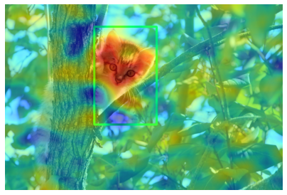
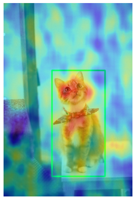
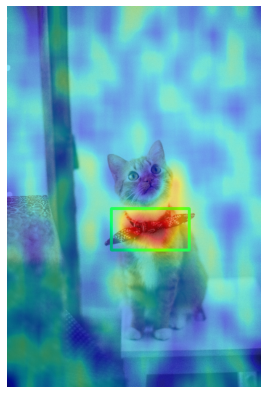
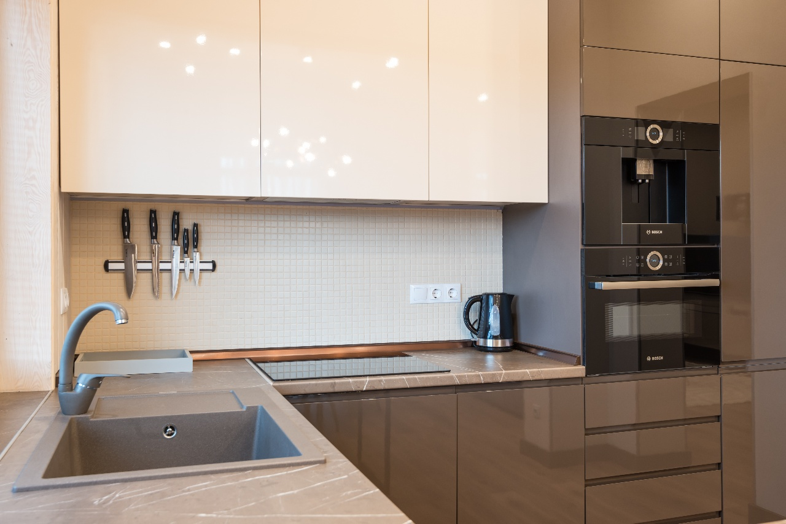
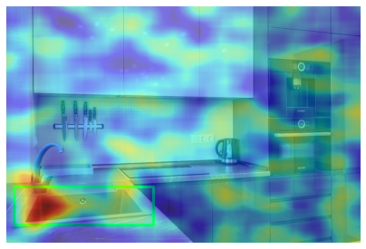

# pytorch_D-RISE

This repository is a third party implementation of [D-RISE](https://arxiv.org/abs/2006.03204) paper using [mmdetection](https://github.com/open-mmlab/mmdetection).

 

  

 

## References

- Petsiuk, Vitali, Rajiv Jain, Varun Manjunatha, Vlad I. Morariu, Ashutosh Mehra, Vicente Ordonez, and Kate Saenko. "Black-box Explanation of Object Detectors via Saliency Maps." Proc. of the IEEE Conference on Computer Vision and Pattern Recognition (CVPR), 2021. [arXiv:2006.03204](https://arxiv.org/abs/2006.03204), [Project Page](https://cs-people.bu.edu/vpetsiuk/drise/)
- Petsiuk, Vitali, Abir Das, and Kate Saenko. "RISE: Randomized Input Sampling for Explanation of Black-box Models." Proceedings of the British Machine Vision Conference (BMVC), 2018. [arXiv:1806.07421](https://arxiv.org/abs/1806.07421), [GitHub](https://github.com/eclique/RISE), [Project Page](http://cs-people.bu.edu/vpetsiuk/rise/)
- Chen, Kai, Jiaqi Wang, Jiangmiao Pang, Yuhang Cao, Yu Xiong, Xiaoxiao Li, Shuyang Sun, Wansen Feng, Ziwei Liu, Jiarui Xu, Zheng Zhang, Dazhi Cheng, Chenchen Zhu, Tianheng Cheng, Qijie Zhao, Buyu Li, Xin Lu, Rui Zhu, Yue Wu, Jifeng Dai, Jingdong Wang, Jianping Shi, Wanli Ouyang, Chen Change Loy, and Dahua Lin. "MMDetection: Open MMLab Detection Toolbox and Benchmark." arXiv preprint arXiv:1906.07155 (2019). [arXiv:1906.07155](https://arxiv.org/abs/1906.07155)

